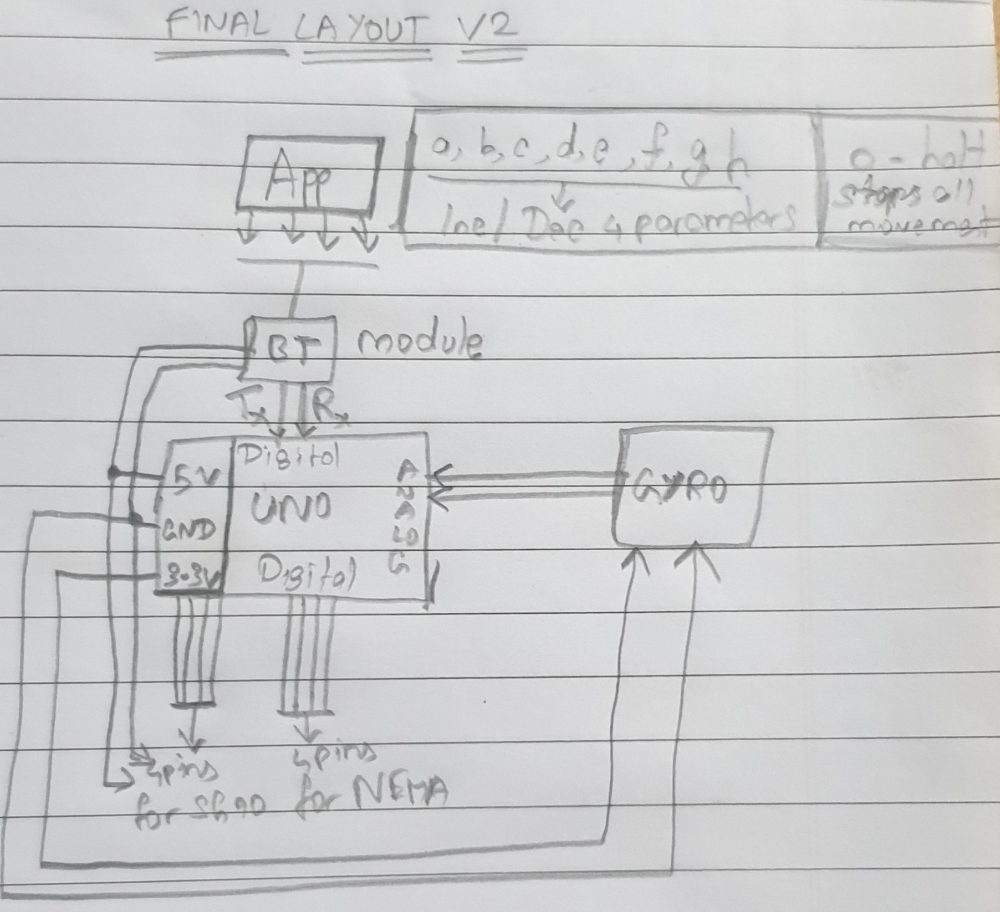
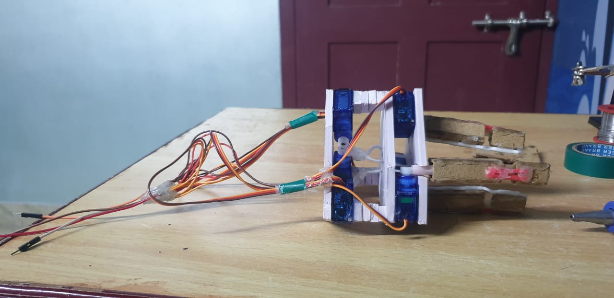
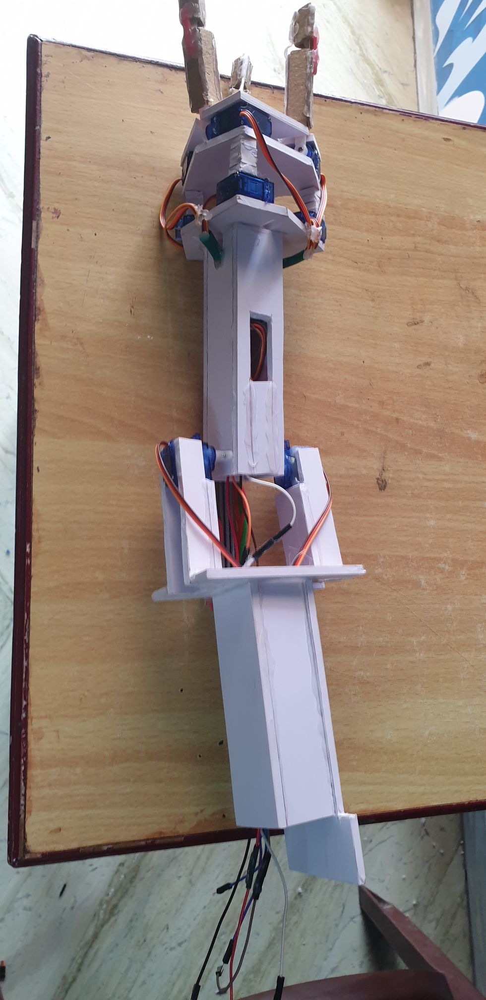

# Robotic arm(s)

 

## 3-fingered robotic arm:

Robotic arm with two nema 17 motors in the base for extended reach. Midway joint consisting of two sg90 servos enables higher controllability of the up down motion, such as maintaining eye level while changing altitude. The head has six SG90 servo motors, three of which directly control the lower section of the fingers. The other three controls an upper gripper section with the use of strings that pass internally.

### Plans:

### Construction:

|Part|Final Image|
|----|-----------|
|Head Lower Section||
|Voltage Divider Circuit||
|Grippers||
|Upper Arm||
|Lower Arm||
|Base Structure||
### Code:
* calibrate: arduino code to setup individual motors to an angle of 90 degrees.
* test1: a halfway test to check the performance of the lower sections of each finger.
* test2: test to check performance of all fingers simultaneously.
* test3: test for controlling grippers using single control pin with fixed finger positions. 
* test4: test for entire upper arm including fingers and grippers simultaneously.
* test5: test movement of elbow joint consisting of two sg90's.
* test6: full showcase of fingers, grippers and elbow.

## Humanoid robotic arm:

As mentioned in [theory](https://github.com/Roboramv2/Robotic-arm/blob/main/theory.md), this idea has been kept aside for later when I have access to a 3D printer service. For reasons as to why, and for detailed plans concerning the arm, check [theory](https://github.com/Roboramv2/Robotic-arm/blob/main/theory.md).

### Plans:
Here are some plans from before I put it away.

