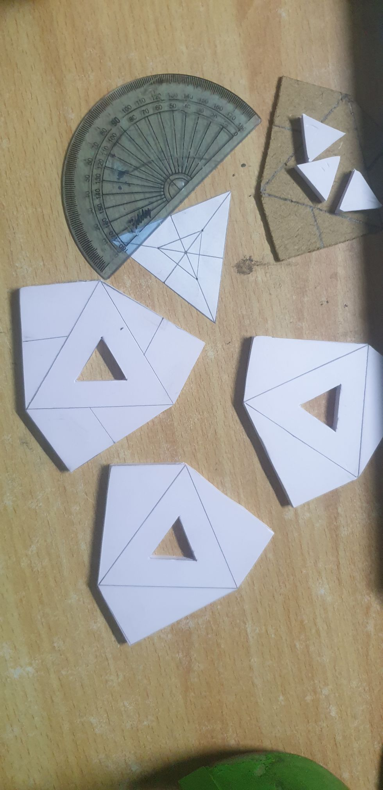
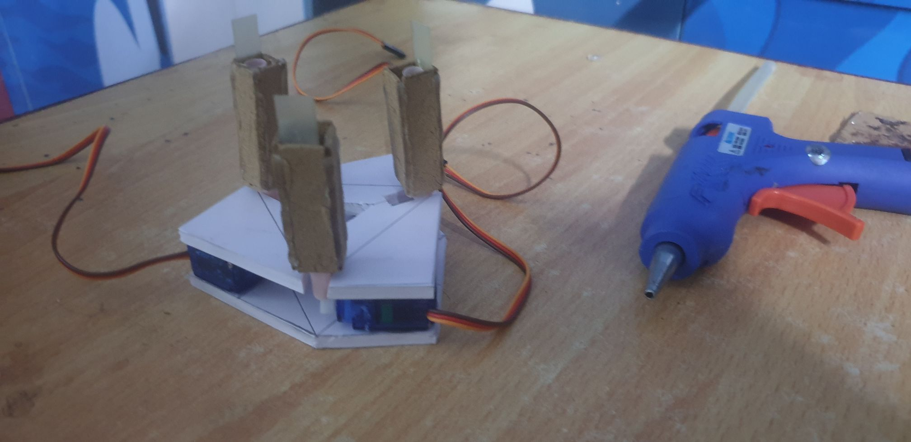

# Robotic arm(s)

## 3-fingered robotic arm:

Robotic arm with two nema 17 motors in the base to facilitate 360 degree rotation as well as up down motion. Midway joint enables the up down motion to have a controllability in an additional forward backward axis. The head has six SG90 servo motors, three of which directly control the lower section of the fingers. The other three controls an upper gripper section with the use of strings that pass internally.

### Plans:

### Construction:

### Code:
* calibrate: arduino code to setup individual motors to an angle of 90 degrees.
* test1: a halfway test to check the performance of the lower sections of each finger.
## Humanoid robotic arm:

As mentioned in [theory](https://github.com/Roboramv2/Robotic-arm/blob/main/theory.md), this idea has been kept aside for later when I have access to a 3D printer service. For reasons as to why, and for detailed plans concerning the arm, check [theory](https://github.com/Roboramv2/Robotic-arm/blob/main/theory.md).

