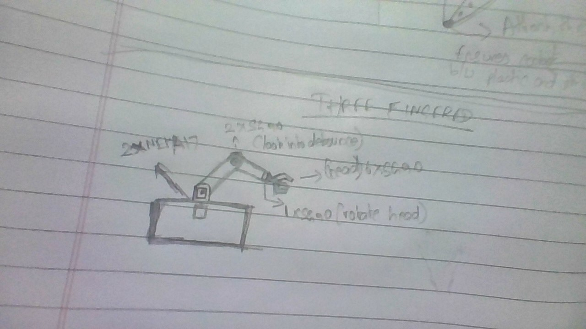

# Theoretical work for the robotic arm
***

## Ideas about 3 finger arm:

Using foamboard casings for everything. String use is minimised, heavy cutdown on number of servos.
Routing for strings broken at joints to facilitate bending. Similar to humanoid arm, two nema17 motors are used as base joints, one for 360 degree rotation and another for up down motion.

Voltage divider is constucted in a similar fashion to my [glove project](https://github.com/Roboramv2/Command-gloves), but this time it is made with much better materials and casings. Soldering for internal connections and hot glur for the casings and external wirings. two 220 ohm resistors in series for 440 ohms, and a 220 with a 330 for 550 ohms. divider can provide close to 5 volts in two ways, both useful for different scenarios:
* From a 12 Volt source, if we use the voltage divider with the 440 ohm side grounded, we obtain 5.3 volts well within the operating range of sg90 motors.
* From a 9 Volt source, if we use the voltage divider with the 550 ohm side grounded, we obtain exactly 5 volts, again in the operating range of the motors.

We use the first mode for more than 4 motors (current capabilities higher in 12V battery). We use the second mode for less than 4 motors (9V battery current drawn is low).

Strings pulled through plastic tubes with break at joint to facilitate bends. Gripper ends made of cardboard, and string ends are bundled inside the tops and glued in. String tension optimal when lower head section servos are at 120 degrees as opposed to 180 degrees as thought initially.

Mapping the parameters within the movement region is done manually. The working values I have noted down after experimenting are given here. For fingers: open min of 60 to 70 degrees, close max of 100 to 120* degrees, and a delay factor of 20 to 30* milliseconds. For grippers: open max of 120 to 130 degrees, close min of 50 to 60* degrees, and a delay factor of 5 to 10 milliseconds. (* to be tested)

To match the weight shift from the forward bend of arm, place heavy components (like the lipo battery) behind the arm. The elbow is implemented with dual sg90 servos operated simultaneously. This unexpectedly lead to the hands inability to raise itself up against gravity. To help it along, we have to confine the working region to around 60 to 70 degrees away from the starting position, as well as provide it some help in moving up. We do the latter with the use of springs and rubber bands that oppose the forward motion, and thereby helps the backward motion. A delay of 15 milliseconds seems optimal for the elbow.

For the base, the initial dual degree rotation has been scrapped due to requirement of both my nema17 motors for one direction itself. Decided to use gyro521 for balancing of base angle as per user command. This complicates things and means that we need to use two controller boards and not one. One board (the arduino mini) will be used to gather bluetooth data, sense gyro values, and control the nema17 motors. The other board(the arduino uno), will be used to collect reduced information from arduino mini and establish control of the 8x SG90 motors in the arm. 

Note: 
* design a circular headbase plate. More regularity allows for better positioning.
* for the midjoint spring system, need a better clamp mechanism than just hot glue and plates.

***
## Initial ideas for humanoid arm:
* general points to build on:
    * internal wiring
    * battery housed in forearm
    * servos form the base of each finger
    * strings control knuckles, servos midjoints
    * strings moved using servos in base of hand
    * layer by layer modeling using foamboard
    * elbow made with nema 17
    * bt slave only module, to receive commands
    * bt module housed in back of hand
    * clamps to hold hand upright when motor is unpowered
    * decide on movement facilitation for knuckle joint (metal pins? springs?)

* knuckle string considerations:
  * plate with spring:
    CON: reduced force exerted by figners, if there is always a spring trying to pull back the fingers, you cant hold objects tightly.
    PRO: easier to make, easily repairable, no internal complexity

  * looped string:
    CON: complex to setup,, takes some tries to get the servos sit right with the finger angles. Internal tubes needed.
    PRO: increased force. there is no opposing spring. (as a side note: this would mean we can make a weird but super cool improved version of our hand, we can make the fingers go back too, as in there is no distinction between palm and back of the hand)

### Conclusion for humanoid arm:
Need precise cut casings for components. IE 3d Printed stuff necessary. This idea is put aside for now.
